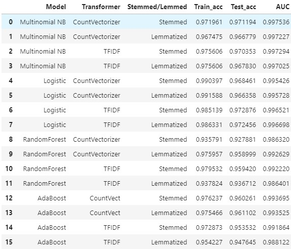

#  Classification of Famous Fantasy Story Texts

### Problem Statement
Poets & Writers is the nation’s largest nonprofit organization serving creative writers. The *Poets & Writers Magazine* is the nonprofit's leading publication that addresses issues of importance to creative writers, from finding an agent to promoting one's book.  The magazine also publishes essays on the literary life, profiles of contemporary authors, and the most comprehensive listing of literary grants and awards, deadlines, and price winners available in print.  And each issue reaches more than 100,000 writers. In this particular case, a creative writing contest was advertised in the magazine, and in particular one that calls for writers to extend the stories of either Lord of the Rings or Harry Potter. *Poets & Writers Magazine* ran into a problem, however, processing their submissions.  The title of each submission was lost during the transfer and *Poets & Writers Magazine* have no way of figuring out which story was related to Harry Potter or Lord of the Rings. 

This project aims to help *Poets & Writers Magazine* classify story submissions as either pertaining to Harry Potter or Lord of the Rings. The goal was to use and optimize Accuracy score as a means of determining the best model, since neither predicting Lord of the Rings nor Harry Potter accurately wasn't more important than the other. 

The audience of the project will be those from *Poets & Writers* that are in charge of the LOTR vs. Harry Potter creative writing contest.  As hired Data Scientist for *Poets & Writers Magazine* I will be solving this problem for them by developing a classification model using text, and unstructured data from two subreddits - one subreddit about Lord of the Rings mythos and the other about Harry Potter. 

---

### Executive Summary 

The process or workflow of this project included: (1) Gathering data from the subreddit's using the Pushshift API, (2) Cleaning the data, (3) Preprocessing the data such as turning the words into stemmed or lemmatized words, (4) Modeling the data, (5) Evaluating each model, and (6) Gathering conclusions from each model. 

In terms of modeling, I chose to use 4 classifiers - Multinomial Naive Bayes, Logistic Regression, Random Forest Model, and AdaBoost Models with Decision Trees as the base estimator.  Within each of the 4 classifiers, I also ran 4 different versions of the classifier varying whether the text had been stemmed or lemmatized, and CountVectorized or TfidfVectorized.  Therefore, there were a total of 16 models.  Among the 16 models, 2 variations of the Multinomial Naive Bayes model outperformed the others, with a high test accuracy of 97% and a high AUC score of 0.99. 

Some observations and conclusions from modeling were that the use of both unigrams AND bigrams improved the model, Harry Potter was predicted more by names in the text rather than content, whereas the opposite was true for Lord of the Rings text. Finally, the Multinomial Naive Bayes is the model that I would suggest to the *Poets & Writers Magazine* in order to classify stories as either Lord of the Rings or Harry Potter.  

---

### Dataset- two subreddits (r/harrypotter and r/tolkienfans)
The source of my data was the two subreddits listed below: 
* r/harrypotter subreddit: A subreddit where individuals are free to discuss everything in the Harry Potter world 
* r/tolkienfans subreddit: A subreddit where Tolkien nerds of reddit debate, and discuss the whole of Tolkien mythos, emphasizing discussion. 
The raw data as well as the clean data is included in the data folder. 

---

### Data Dictionary of all the features used in modeling

|Feature|Type|Dataset|Description|
|---|---|---|---|
|subreddit|string|posts scraped from subreddits|the subreddit the post came from (either harrypotter or tolkienfans)| 
|title|string|posts scraped from subreddits|title of the reddit post| 
|created_utc|int|scraped from reddit pushshift api|Epoch & Unix TimeStamp| 
|selftext|string|posts scraped from subreddits|content of the reddit post|
|title_selftext|string|posts scraped from subreddits|title column and selftext combined, and words only|
|author|string|posts scraped from subreddits|author of the reddit post title and post content| 
|media_only|boolean|posts scraped from subreddits|True/Flase value of whether or not the post contained media only or also had text| 
|permalink|string|scraped from reddit pushshift api|Tail end of the url to that specific reddit post| 
|text_length|int|engineered feature|word count of the title_selftext column| 
|clean_text_stem|string|engineered feature|the title_selftext column with stopwords removed, and then stemmed| 
|clean_text_lem|string|engineered feature|the title_selftext column with stopwords removed, and then lemmatized| 

---
### Conclusions/Recommendations 

1) To the Poets & Writers Magazine, use the Multinomial Naive Bayes model to predict whether the story is a Harry Potter series story or a Lord of the Rings story. 

2) Words that are the most predictive include: “dumbledore, tolkien, ring, hobbit, sauron, harry, hogwart”

3) Harry Potter predictive words tended to lean towards names, whereas the predictive words for LOTR were more content based. 

4) Because the words that predicted Harry Potter were more often names, than not, the modeling iteration where I took out the names saw a decrease in model performance. It is speculated that if many more names were taken out of both harry potter and lord of the rings observations, the model's performance would decrease significantly for harry potter (precision/true positive rate), but may not have as strong of an effect on the lord of the rings predictions (recall/specificity/true negative rate)

5) Redditors that talk about lord of the rings seem to be discussing more so about the story content and literary themes and objects rather than actual characters.  It seems like it's the opposite with harry potter because the model is so dependent on the names in  harry potter. 
 

### Areas for Further Study/Research 
1) It would be interesting to run an iteration of the model with all the names taken out completely from both reddits to see how the model performs.  If this is done, then perhaps some conclusions about the reading comprehension or writing skill of the redditors on each subreddit could be gauged. 
2) In addition, the time submission of the reddit posts could also be analyzed in further iterations to see the trend of when redditors on each subreddit usually post.

---

### File Directory
project-3
* README.md
* code
    * comments_scrape
        * Reddit API Notes-comments.ipynb
        * reddit_scrape_comments_script.ipynb
        * reddit_scrape_comments_script.py
    * post_scrape
        * Reddit API Notes.ipynb
        * reddit_scrape_post_script.ipynb
        * reddit_scrape_post_script.py
    * data_wrangling_modeling
        * boosting_models
            * countvect_lem_boost.ipynb
            * countvect_stem_boost.ipynb
            * tfidf_lem_boost.ipynb
            * tfidf_stem_boost.ipynb
        * log_reg_models
            * countvect_lem_log.ipynb
            * countvect_stem_log.ipynb
            * tfidf_lem_log.ipynb
            * tfidf_stem_log.ipynb
        * naive_bayes_models
            * countvect_lem.ipynb
            * countvect_stem.ipynb
            * tfidf_lem.ipynb
            * tfidf_stem.ipynb
        * random_forest_models
            * countvect_lem_rf.ipynb
            * countvect_stem_rf.ipynb
            * tfidf_lem_rf.ipynb
            * tfidf_stem_rf.ipynb
        * score_tables_code
            * model_score_table.ipynb
            * no_names_model_score_table.ipynb
        * 00_functions.ipynb
        * 01_eda_cleaning.ipynb
        * 02_eda_cleaning_removed_names.ipynb
        * models_removed_names.ipynb
* data
    * clean_data
        * clean_posts_no_names.csv
        * clean_posts.csv
    * result_scores
        * boost_countvect_lem.csv
        * boost_countvect_stem.csv
        * boost_tfidf_lem.csv
        * boost_tfidf_stem.csv
        * logreg_countvect_lem.csv
        * logreg_countvect_stem.csv
        * logreg_tfidf_lem.csv
        * logreg_tfidf_stem.csv
        * nb_countvec_lem.csv
        * nb_countvec_stem.csv
        * nb_tfidf_lem.csv
        * nb_tfidf_stem.csv
        * no_names_boost_countvect_stem.csv
        * no_names_logreg_tfidf_stem.csv
        * no_names_nb_countvect_stem.csv
        * no_names_rf_tfidf_stem.csv
        * rf_countvect_lem.csv
        * rf_countvect_stem.csv
        * rf_tfidf_lem.csv
        * rf_tfidf_stem.csv
    * reddit_comments.csv
    * reddit_posts.csv
* presentation
    * Project_3_Presentation.pdf
    * imgs
        * cm_boost_countvect_lem.jpg
        * cm_boost_countvect_stem.jpg
        * cm_boost_tfidf_lem.jpg
        * cm_boost_tfidf_stem.jpg
        * cm_logreg_countvect_lem.jpg
        * cm_logreg_countvect_stem.jpg
        * cm_logreg_tfidf_lem.jpg
        * cm_logreg_tfidf_stem.jpg
        * cm_nb_countvec_lem.jpg
        * cm_nb_countvec_stem.jpg
        * cm_nb_tfidf_lem.jpg
        * cm_nb_tfidf_stem.jpg
        * cm_rf_countvect_lem.jpg
        * cm_rf_countvect_stem.jpg
        * cm_rf_tfidf_lem.jpg
        * cm_rf_tfidf_stem.jpg
        * common_lem_words.jpg
        * common_stem_words.jpg
        * logreg_tfidf_stem_coefs_large.jpg
        * logreg_tfidf_stem_coefs_small.jpg
        * nb_countvec_stem_coefs_large.jpg
        * nb_countvec_stem_coefs_small.jpg
        * no_names_boost_countvect_stem_featureImp.jpg
        * no_names_cm_boost_countvect_stem.jpg
        * no_names_cm_logreg_tfidf_stem.jpg
        * no_names_cm_nb_countvect_stem.jpg
        * no_names_cm_rf_tfidf_lem.jpg
        * no_names_cm_rf_tfidf_stem.jpg
        * no_names_model_scores.jpg
        * no_names_rf_tfidf_lem_featureImp.jpg
        * no_names_rf_tfidf_stem_featureImp_scr.jpg
        * no_names_rf_tfidf_stem_featureImp.jpg
        * rf_countvect_lem_featureImp.jpg
        * rf_countvect_stem_featureImp.jpg
        * rf_tfidf_lem_featureImp.jpg
        * rf_tfidf_stem_featureImp_scr.jpg
        * rf_tfidf_stem_featureImp.jpg
        * Scores_table_full.jpg
        * word_count_hist.jpg
---

### Sources 
**Reddits**
* Tolkien: https://www.reddit.com/r/tolkienfans/
* Harry Potter: https://www.reddit.com/r/harrypotter/

**API**
* https://github.com/pushshift/api

**Poets & Writers Magazine**
* https://www.pw.org/about-us/about_poets_amp_writers
* https://www.pw.org/grants

