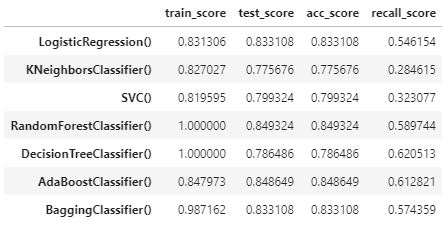
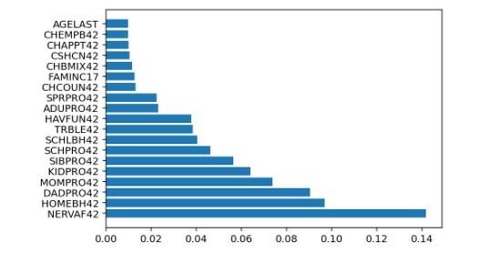
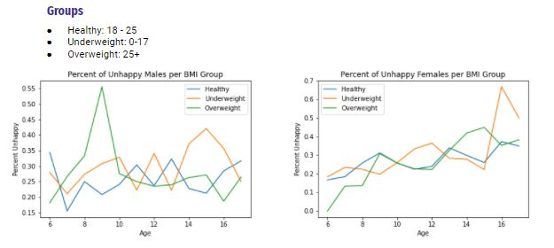
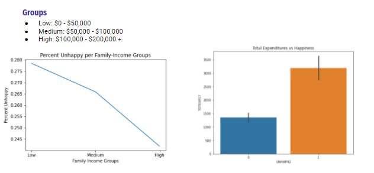

## Evaluating Mental Health Status of Children 
---
### Table of Contents

- Problem Statement
- Executive Summary
- Dataset
- Modeling Process
- Conclusion and Recommendations
- Areas for Further Study/Research
- File Directory

---

### Problem Statement

The goal of this project was to evaluate the different factors that may put children at-risk for developing poor mental health. We examined the effect of factors such as special healthcare needs, behavior, healthcare access, and physical health check-ups.  Within our dataset, our target variable was UNHAP42.  This variable was gathered from a survey that asks children whether or not they feel unhappy or sad. 

---

### Executive Summary

- Background

Being mentally healthy during childhood means developing emotional and healthy social skills, as well as learning a healthy way to cope with problems. Children who are mentally healthy have a positive quality of life and can function well at home, in school, and in their communities. 

Mental disorders among children are described as changes in the way children learn, behave, and handle emotions which may lead to stress, and anxiety for children throughout the day.  In addition, children may display disruptive behavior.  If these symptoms persist, and begin to interfere with school, home, or play activities, then it is possible the child may have a mental disorder. Mental disorders in children may include ADHD, behavior problems, anxiety, and depression. Many family, community, and healthcare factors are related to children’s mental health.

- Project Goal

The goal of this project was to evaluate the different factors that may put children at-risk for developing poor mental health. We examined the effect of factors such as special healthcare needs, behavior, healthcare access, and physical health check-ups.  Within our dataset, our target variable was UNHAP42.  This variable was gathered from a survey that asks children whether or not they feel unhappy or sad. 

- Metrics

The metrics we used to evaluate our model was recall/sensitivity and accuracy, because we wanted to minimize the false negatives.  It was therefore more important to classify a child as unhappy, even if they really were happy, instead of classifying the child as happy when they were really unhappy.
 
- Modeling

To model this variable we chose 3 types of models - logistic regression, random forest, and adaboost - and varied their hyperparameters.  A pruned Random Forest Classifier (max_depth = 20, n_estimators = 180) with balanced classes ended up performing the best according to the recall and accuracy optimization. 

- Findings

Our findings included NERVAF42, HOMEBH42, KIDPRO42, CHLIM42 and WHNSAF42 were the most important in determining at-risk children for mental health disorders.  Each of these factors affected the UNHAP42 score in varying degrees.  These effects are detailed in the conclusions section.  

---

### Dataset

Data and Data Dictionary:
[Data](https://meps.ahrq.gov/mepsweb/data_stats/download_data_files_detail.jsp?cboPufNumber=HC-201)

Data was collected from the Department of Health and Human Services, Agency for Healthcare Research and Quality (AHRQ).  AHRQ administers the Medical Expenditure Panel Survey (MEPS) every year.  This survey is a group of surveys intended to provide national estimates of health expenditures, utilization, payment sources, health status, and health insurance coverage among noninstitutionalized, nonmilitary populations of the US. It is a series of government-produced data sets that can be used to examine how individuals interact with the medical care system in the United States.  This dataset describes the Household Component of the government dataset and provides comprehensive national estimates of health care use and payment by individuals, families, and any other demographic group of interest. 

This data was acquired by using R documentation and programming statements needed to import an ASCII data file (.dat) into R.  The MEPS data was imported into R as a dataframe, converted into a .feather file and then saved and imported into python. 

Very little feature engineering and data cleaning was required of this dataset due to the extensive work statisticians had already done with it.  The minimal changes we did to the dataset included: 
Filtering out null values from our target variable (UNHAP42) 
Balancing the target variable classes with the SMOTE from the imblearn library in python
Subsetting our data to only include ages between 5-17 years old 
Standard scaled all our variables in order to minimize the effect of the negative values that the statisticians had inputted into the “NA” or “Inapplicable” values of the survey. 

---

### Modeling Process

We decided to use UNHAP42 as our target variable.  This variable was collected from a survey question asking whether or not the child reported feeling unhappy or sad. 

The first step in the modeling process involved the use of a modeling function.  This function was passed our data, split, and a list of classifiers used to predict or target variable UNHAP42.  The results of this function can be seen in the figure below, the modeling function only produces models with default parameters.  Thus, the top 2 models, logistic regression and random forest,  from this output were chosen for further investigation.

 

The logistic regression model, chosen from the modeling function above, was already above the baseline and had a very balanced bias-variance tradeoff.  With a recall score of .5461 and a difference of only .0018 between training and testing scores there was not much to do in regards to regularization.  Regardless, a pipeline and gridsearchcv were used to test for optimum parameters.  The best parameters chosen by the grid search can be seen in Model_LogisticRegrssion, which increased the gap between training and testing scores and reduced our recall score.

The logistic regression model did not improve recall which is our ability to correctly label positive, or in the context of our model unhappiness in children.  The overall recall score for this model is .49, which is not very good since the main metric of the project is recall.  One of the biggest issues affecting recall in the context of our model was the fact that our classes were unbalanced.  In an attempt to create a balanced sample Smote was used and can be seen in Model_LogisticRegression_Smote.  The use of smote helped us by oversampling the minority class and undersampling the majority creating balanced classes.  Our best logistic regression model had a recall score of .7544, this was attained using smote and gridsearchcv.  Below is a figure showing the differences between each logistic regression model.

Another high performing model we wanted to experiment with was the Random Forest Classifier.  After grid-searching through a random forest classification model, the random forest was pruned to a max depth of 20, number of estimators set to 180, min samples in leaf equal to 2, and min samples to split by set equal to 2.   Even with the grid-search parameters optimized, the recall score was still only 0.57, which is not much better than a randomized trial.  Instead, the imblearn python library was used to implement SMOTE which is a method of oversampling the minority class and undersampling the majority class.  After implementing this strategy the pruned random forest model had a recall score of 0.81 which and an accuracy of 0.82.  This was the best model, and the one we used to make conclusions about which factors/indicators were more correlated with a child being unhappy.  Some of the most important features to the random forest model were whether the child felt nervous, whether their relationship with mom, dad, siblings, and other kids were poor, fair, good, or excellent (0-4). 

 

---

### Conclusions and Recommendations

After extensive EDA and modeling results, it was determined that the Columbia Impairment Scale (CLS) questionnaire had the strongest correlation to the target variable. A higher score on any of the CLS questions led to a higher chance of that child answering that they were unhappy. The special needs questions also showed strong correlation to unhappiness. As children who answered yes to any of the screener questions had a higher chance of answering that they were unhappy in the CLS questionnaire. 

Sex, Age, and BMI were used to group children into two groups (Male, Female) and then grouped once more by their BMI (Healthy, Underweight, Overweight). Males had no visible trend in unhappiness as age increased. Females, however,  showed a steady increase of percent unhappy as age increased among all three BMI groups, with underweight females who are 16 being the highest percent unhappy at ~70%. This is a very large percentage of females and gives critical insight as to what types of struggles these young girls are dealing with. It was undetermined if underweight BMI was causing unhappiness, or vise-versa, but the main takeaway from this information was that teenage girls are the group most affected by unhappiness, and that researchers should focus more on this group.

Family income and total medical expenditures were also examined, but very little change among income groups was observed.

 

Based off of these findings, we recommend that researchers who are attempting to study unhappiness among adolescents should group them by sex, age, and bmi, as these groups all showed distinct trends in unhappiness and should be studied separately. It was also determined that children with special health care needs are more likely to be unhappy than their peers. One specific negative attribute for a child with special needs is that the child cannot participate in activities other children can (FOMO - Fear of missing out). This FOMO effect was found to be very negative on children and their happiness. 

Nervousness was seen as the number one contributor to unhappiness among all children in our research, as nervousness increased, so did unhappiness. From this information, if parents notice that their child is experiencing nervous behavior, our research suggests they are also unhappy. Parents can then take note of this state and take their own course of action to fix it. We found that a healthy home environment was also strongly correlated to adolescent unhappiness, so it is very important for parents to foster a safe and nurturing environment. The CLS questionnaire points to all the areas that are important to a child's happiness, so as a parent, making sure the child has good relationships with their peers, parents, siblings etc. is key to ensuring happiness.  

---

### Areas for Further Study/Research

To further investigate factors that affect children’s mental health, our analysis shows that assessing a child’s home environment could easily reveal more factors that contribute to the mental health status of children.  Further data collection and surveys would focus on factors involving the home environment. 

---

### File Structure

* Code: 
    * shaping_df_md - file used to create both csv files contained in data folder
    * eda_visuals - file where all eda and visuals are collected for project
    * model.py - python file used for modeling function
    * model_function - file used to run modeling function from model.py
    * adaboost_model - file containing adaboost modeling attempt
    * Model_LogisticRegression - file containing logistic regression gridserchcv
    * Model_LogisticRegression_Smote - file contain logistic regression with balanced classes using Smote from imblearn library
    * rf_og_micelmp_sc - original dataset with randomforest classifier
    * rf_og_recall_sc - original dataset with randomforest classifier, optimizing for recall
    * rf_og_sc - original dataset with randomforest classifier, optimizing for accuracy
    * rf_smote_pca_sc - randomforest classifier, with the use of Smote and PCA optimizing for accuracy
    * rf_smote_recall_sc - randomforest classifier, with the use of Smote optimizing for recall
    * rf_smote_sc - randomforest classifier, with the use of Smote optimizing for accuracy
* Slides - contains presentation pdf file
* charts_graphs - contains pictures of graphs and sharts used in presentation and readme.md
* data - Contains two csv files, one is a list of variables and the other is or variables and target for modeling

---

### Sources
- [CDC](https://www.cdc.gov/childrensmentalhealth/basics.html)
- [MEPS](https://meps.ahrq.gov/mepsweb/data_stats/download_data_files.jsp)
- [MEPS-PDF](https://meps.ahrq.gov/data_stats/download_data/pufs/h201/h201doc.pdf)
- [MEPS-GitHub](https://github.com/HHS-AHRQ/MEPS)

---